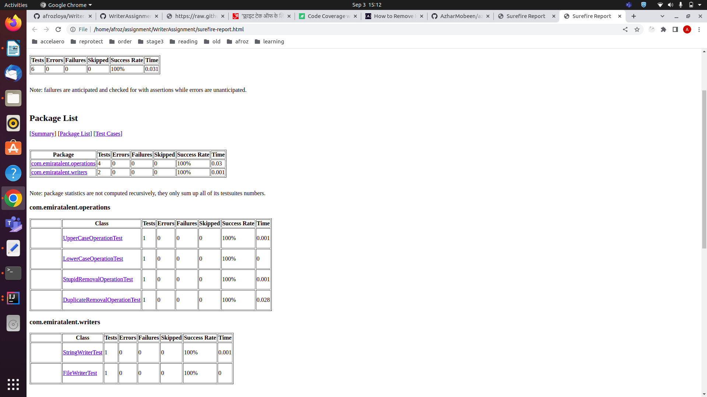

# EmiraTalent - WriterAssignment

It's a simple maven based java project. 

#Problem Statement:

There are two kinds of Writers: StringWriter which writes to a String and FileWriter that writes to a file (these are not related to those classes provided in Java). There can be other types of Writers (like SocketWriter that writes to a Socket) in the future.
A Writer simply writes to a target (like string or file) until close is called. Any effort to write after the call to close is simply ignored.

There are several types of operations that can be performed on these two (or other types added in the future) writers. For example:
lower case: This converts the string being written to all lower case
upper case: This converts the string being written to all upper case etc

#### Technologies:
- Java11
- Maven project
- JUnit 5
- JaCoCo
- Docker

#### How to run

###### Run without Docker from mvn
```
mvn exec:java -Dexec.mainClass=com.emiratalent.EmiraTalentApp
```

###### Run without Docker by creating a jar

###### Create the jar file
```
mvn package
```

###### Run the jar file
```
java -jar target/emiratalent-jar-with-dependencies.jar
```


##### Run as a Docker
###### Build Docker image
* Run below command:
```
docker build -t emiratalent:1.0 .
```
###### Run Docker image
```
docker run emiratalent:1.0
```

###### To generate unit testing report
```
mvn surefire-report:report
```

###### Report location
file:///{project_root}/target/site/surefire-report.html

Reports:

